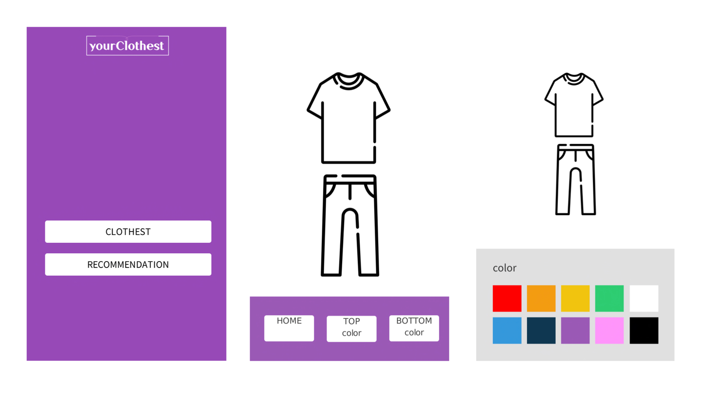
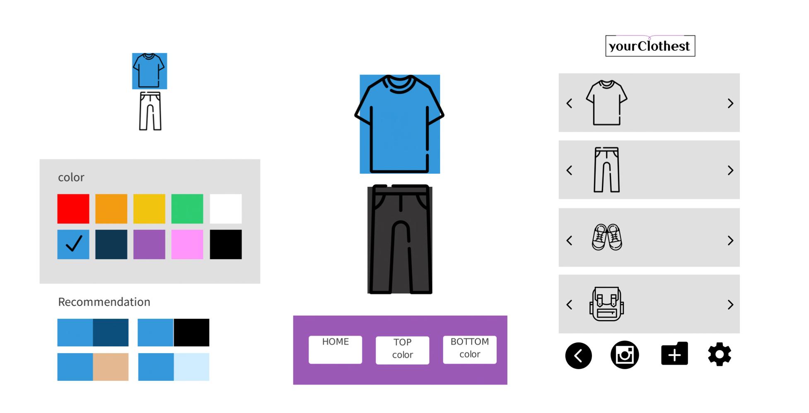

# README.md

## **👒 Description**

It starts from the idea that how to reduce the discomfort of people who have difficulty with thinking about what to wear every day. We want to create a helpful application while using existing clothes.

YourClothest provides an environment where users can store their actual clothes as image files using a camera, sort them in a virtual wardrobe, and then virtually match them. In addition, overall coordination is possible by recommending and matching color combinations of clothes.

## 🕶️ Features

- Utilize image files.
- Register and classify your clothes in real life by Camera recognition
- Recommendation based on color coordination

## **🥼 Environment**

This project is an Android application.

You can clone and run it on the Android studio.

It requires minimum SDK API 16 : Android 4.1 (Jelly Bean)

## **👔 Prerequisite**

Camera open source and clothing recognition open source are required.

[AndroidSweetSheet](https://github.com/zzz40500/AndroidSweetSheet)

[color picker](https://github.com/kristiyanP/colorpicker)

## **👖 Files**

(will be updated soon) this section informs you some brief explanation of the files.

## **👗 Usage**

(will be updated soon) this section informs you how to execute the project code.

## 📷 Preview

## **🧦 License**

Apache License 2.0

## **👟 Contributing**

Contributions, issues and feature requests are welcome. We will accept and commit your pulled requests after reviewing as soon as possible!

If you have any questions about our project, feel free to ask!
We are 24/7 open on any comments, and also by email.

Contact : julieish45@gmail.com
