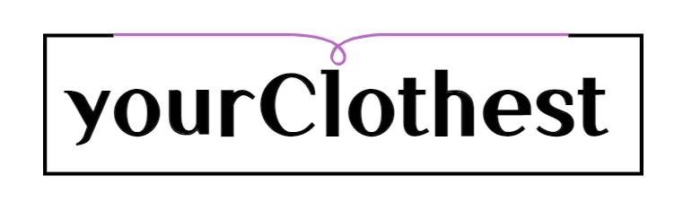
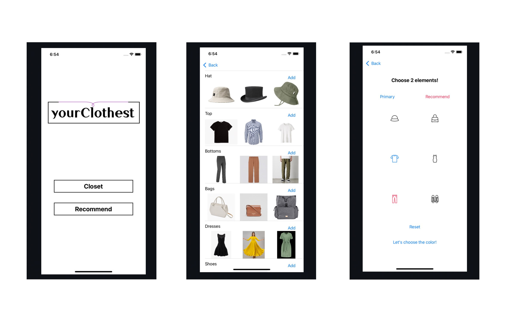
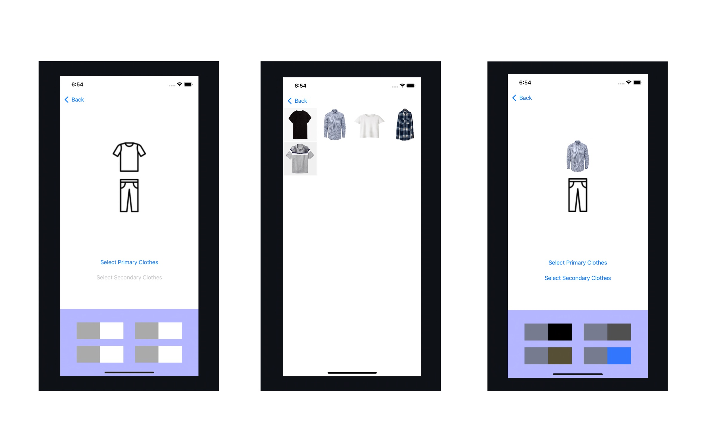
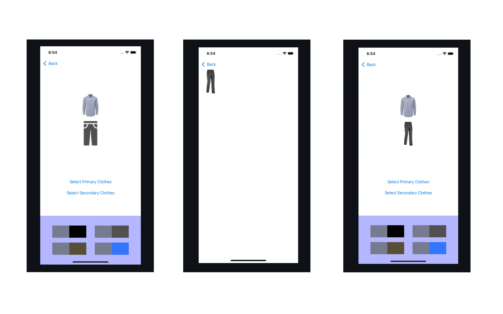

# README.md

## **👒 Description**

It starts from the idea to reduce the discomfort of people who have difficulty with thinking about what to wear every day. We want to create a helpful application while using your existing clothes.

YourClothest provides an environment where users can store their actual clothes as image files using a camera, sort them in a virtual wardrobe, and then virtually match them. In addition, overall coordination is possible by recommending and matching color combinations of clothes.

## 🕶️ Features

- Utilize image files.
- Register and classify your clothes in real life
- Recommendation based on color coordination

## **🥼 Environment**

This project is an iOS application.

You can clone and run it on Xcode

You need later version than iOS14 and Swift 5.

## **👔 Prerequisite**

We used an open source project for this project.
You can check the adopted open source with the link below.
You have to install cocoapods for error free implementation.

[UIImageColors](https://github.com/jathu/UIImageColors)

## 📷 Preview

## **🧦 License**

Apache License 2.0

## **👟 Contributing**

Contributions, issues and feature requests are welcome. We will accept and commit your pulled requests after reviewing as soon as possible!

If you have any questions about our project, feel free to ask!
We are 24/7 open on any comments, and also by email.

Contact : julieish45@gmail.com
