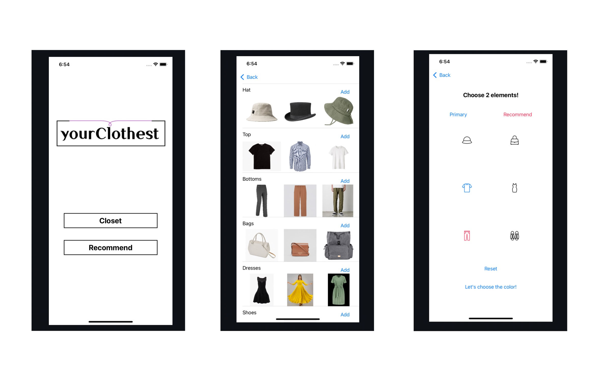

*****
how to use Application
*****

You can see the two buttons.

"CLOTHEST", You can see the virtual closet. 
   * Click "ADD" to register your clothes.
   * Swipe the images to see all of the added.

You can see the your virtual clothest or register the clothes.

Clothest has the six sections - Hat,Top,Bottom,Bag,Dress,Shoes.

The clothest is sorted according to the type of clothes.

You can easily check the clothes you have.

There is 'ADD' at rigth top of the each section.

Register the clothes, click *camera* or *gallery* 

"RECOMMENDATION", You can get the recommendation of color combination.
   * Color combination consists of 'recommend' according to 'primary'
   * Choose the category of primary and recommend.
   * Choose clothes from the list of 'primary' category you have in the virtual closet.
   * Choose the color combination 
   * Choose clothes from the list of 'recommend' category filtering by selected color.

.. image:: ../imgs/03_recommendation.jpg
   :alt: primary
   :scale: 30

.. image:: ../imgs/04_select_ac_recm.jpg
   :alt: recommend
   :scale: 30

You can see the six icons.

The icon first clicked will change to pink color, it will be 'primary' category.

The icon second clicked will change to blue color, it will be 'recommend' category.

At the next page, you can choose the clothes from the list of 'primary' category you have.

The color is automatically extracted, also 'recommend' color will change to the ideal combination color according to 'primary'.

You can get the color combination recommendation according to 'primary' color.

The color palette on the bottom consists of the 'primary' and 'recommend' color box.

Choose one color combination, then you can choose the clothes from the list of 'recommend' category filtering by selected color.
